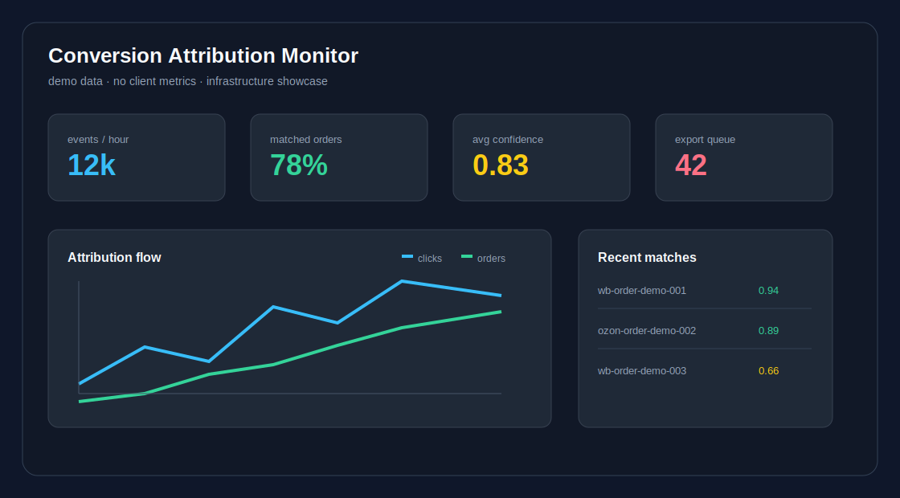
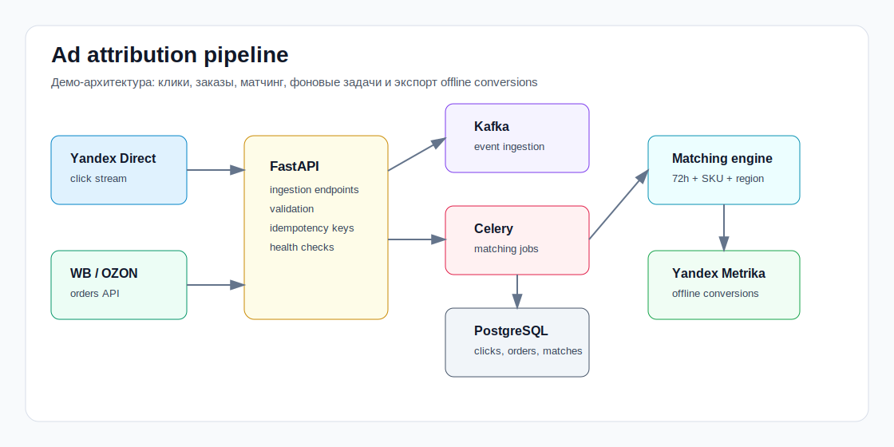

# Ad Optimization Demo

Публичная demo-версия backend-сервиса для атрибуции рекламных конверсий.

Проект показывает, как можно связать клики из рекламных систем с заказами маркетплейсов, посчитать confidence attribution match и подготовить offline conversions для отправки в аналитику.

> Это showcase-проект: внутри нет клиентских данных, реальных токенов, коммерческих метрик и production-секретов.



## Что делает сервис

- Принимает события рекламных кликов.
- Принимает заказы из marketplace-like источников.
- Сохраняет события в PostgreSQL.
- Запускает фоновые задачи матчинга через Celery и Redis.
- Поддерживает ingestion через Kafka topics.
- Считает confidence score по времени, товару, региону и user hash.
- Готовит offline conversions для отправки в Yandex Metrika-подобный adapter.
- Демонстрирует инфраструктуру через Docker Compose.

## Архитектура



Основной поток:

1. `FastAPI` принимает клики и заказы через REST API.
2. `Kafka consumer` может принимать те же события из topics `ad.clicks` и `marketplace.orders`.
3. `PostgreSQL` хранит клики, заказы и рассчитанные связи.
4. `Celery worker` периодически ищет лучший рекламный клик для каждого заказа.
5. `Metrika adapter` имитирует экспорт offline conversions.

## Стек

- `Python 3.12`
- `FastAPI`
- `PostgreSQL`
- `SQLAlchemy`
- `Celery`
- `Redis`
- `Kafka`
- `Docker Compose`
- `Pytest`

## Matching logic

Матчинг сделан эвристически. Для заказа выбирается лучший клик внутри attribution window:

- клик должен быть раньше заказа;
- клик должен попадать в окно `72h`;
- совпадение `product_sku` дает основной вес;
- совпадение региона повышает confidence;
- совпадение `user_hash` повышает точность;
- свежие клики получают небольшой recency bonus.

Упрощенный пример:

```python
if order.product_sku == click.product_sku:
    score += 0.45

if order.region_code == click.region_code:
    score += 0.25

if order.user_hash and click.user_hash and order.user_hash == click.user_hash:
    score += 0.20
```

## Быстрый запуск

```bash
cp .env.example .env
docker compose up --build
```

API будет доступен на:

```text
http://localhost:8000/api/health
```

Swagger:

```text
http://localhost:8000/docs
```

## Демо-данные

После старта контейнеров можно добавить тестовые клики и заказы:

```bash
docker compose exec api python scripts/seed_demo.py
docker compose exec worker celery -A app.workers.tasks.celery_app call app.workers.tasks.attribute_pending_orders
```

Проверить результат:

```bash
curl http://localhost:8000/api/attributions
```

## Примеры запросов

Создать рекламный клик:

```bash
curl -X POST http://localhost:8000/api/events/clicks \
  -H "Content-Type: application/json" \
  -d '{
    "click_id": "yclid-demo-001",
    "campaign_id": "brand-search",
    "product_sku": "WB-DRYER-100",
    "region_code": "RU-MOW",
    "user_hash": "u-42",
    "click_price": 18.4,
    "clicked_at": "2026-06-27T08:00:00Z"
  }'
```

Создать заказ:

```bash
curl -X POST http://localhost:8000/api/events/orders \
  -H "Content-Type: application/json" \
  -d '{
    "order_id": "wb-order-demo-001",
    "marketplace": "wildberries",
    "product_sku": "WB-DRYER-100",
    "region_code": "RU-MOW",
    "user_hash": "u-42",
    "revenue": 5290,
    "ordered_at": "2026-06-27T16:00:00Z"
  }'
```

## Структура проекта

```text
app/
  api/          REST endpoints
  core/         settings
  db/           SQLAlchemy session
  events/       Kafka consumer
  models/       database models
  schemas/      Pydantic schemas
  services/     matching and export adapters
  workers/      Celery tasks
docs/assets/    README visuals
scripts/        demo data scripts
tests/          matching tests
```

## Production notes

Что важно в реальной production-версии:

- Idempotency для кликов, заказов и экспорта конверсий.
- Advisory locks или distributed locks для batch sync.
- Rate limiting и retry policy для внешних API.
- Dead-letter queue для событий, которые не прошли валидацию.
- Отдельный audit log для отправленных offline conversions.
- Метрики по lag, match rate, confidence distribution и export errors.
- Разделение demo config и production secrets через secret manager.

## Почему это полезно для бизнеса

Без offline conversions рекламная система видит только клики и часть on-site событий. Если заказ происходит позже или во внешнем marketplace-контуре, оптимизация ставок становится менее точной.

Такой сервис возвращает в аналитику факт покупки, сумму заказа и связь с рекламным кликом. Это помогает точнее оценивать кампании, отключать слабые связки и усиливать работающие.

## Статус

Demo-ready. Код предназначен для демонстрации архитектуры, backend-слоев и инфраструктурного подхода.
